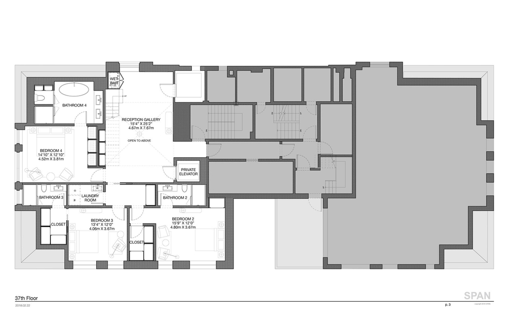
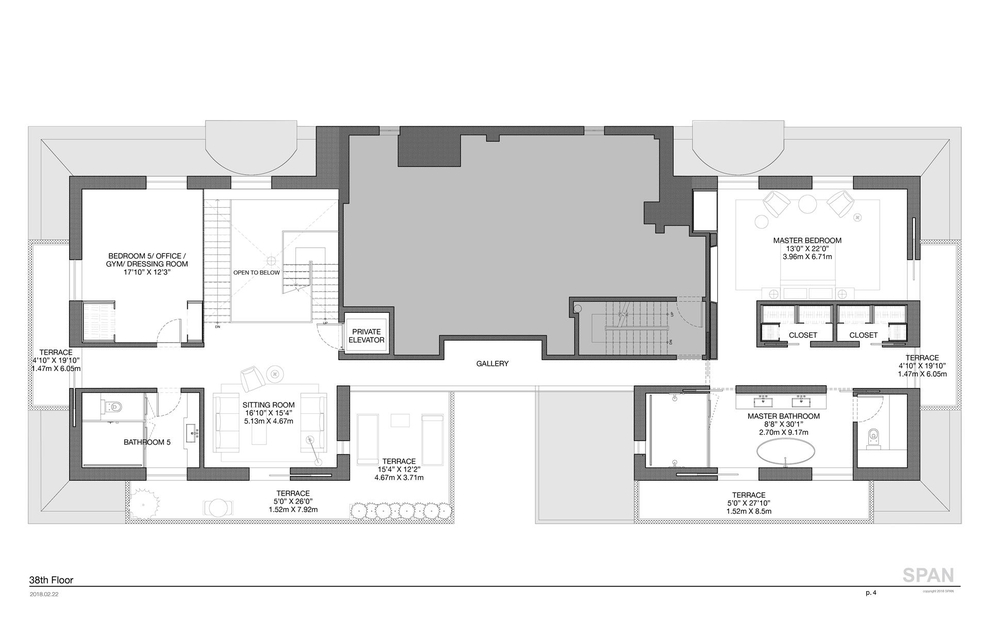
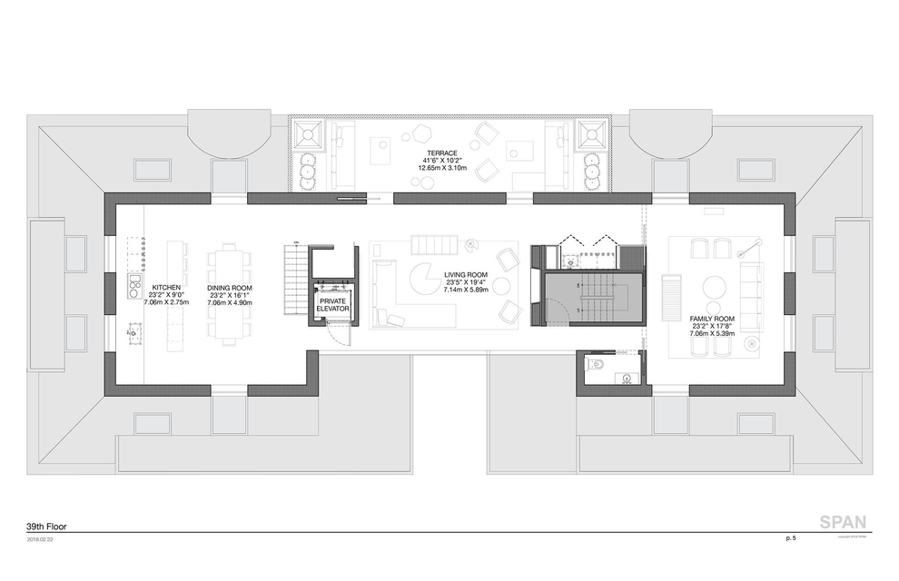
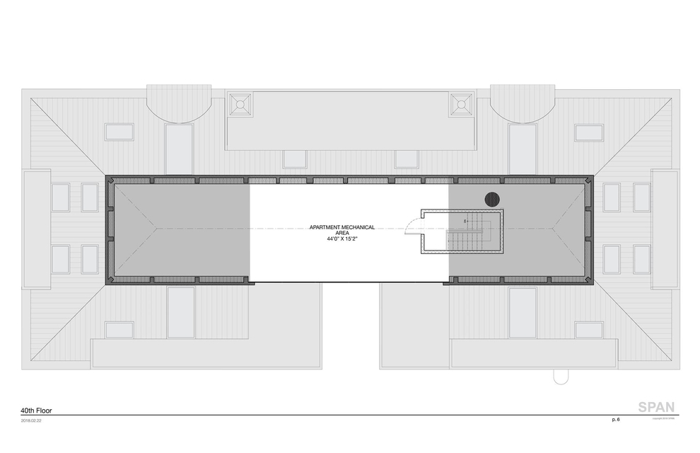

SPAN Architecture developed plans to combine the 37th floor of 150 Central Park South with the building's rooftop attic to create a one-of-a-kind penthouse overlooking Central Park.

&#8593; landing floor where a guest wing with separate laundry close is located.   

&#8593; the master floor also houses a den fit for a gym or office, as well as a large bathroom that easily fits a steam shower and a sauna. The gallery connecting two wings of the floor gets floor-to-ceiling-glass-sided, unobstructed view to the south, while also creating privacy for the master bedroom, which sports two terraces. The only problem might be the limited size of the master closets.   

&#8593; the top floor of the penthouse is an entertainment paradise, with a lavish north-facing terrace taking in the Central Park views, a family room that can be conveniently closed off, and wet bar concealed in a closet. The living room really combines the best of two worlds with the large, paneled glass to the south and the terrace to the north, creating an airy and elegant feel.   

&#8593; the mechanical floor of the penthouse. In SPAN's rendering, an indoor pool occupies this area.  

Sources: [RealtyHop](https://www.realtyhop.com/building/150-central-park-s-10019/ph/2049974)
