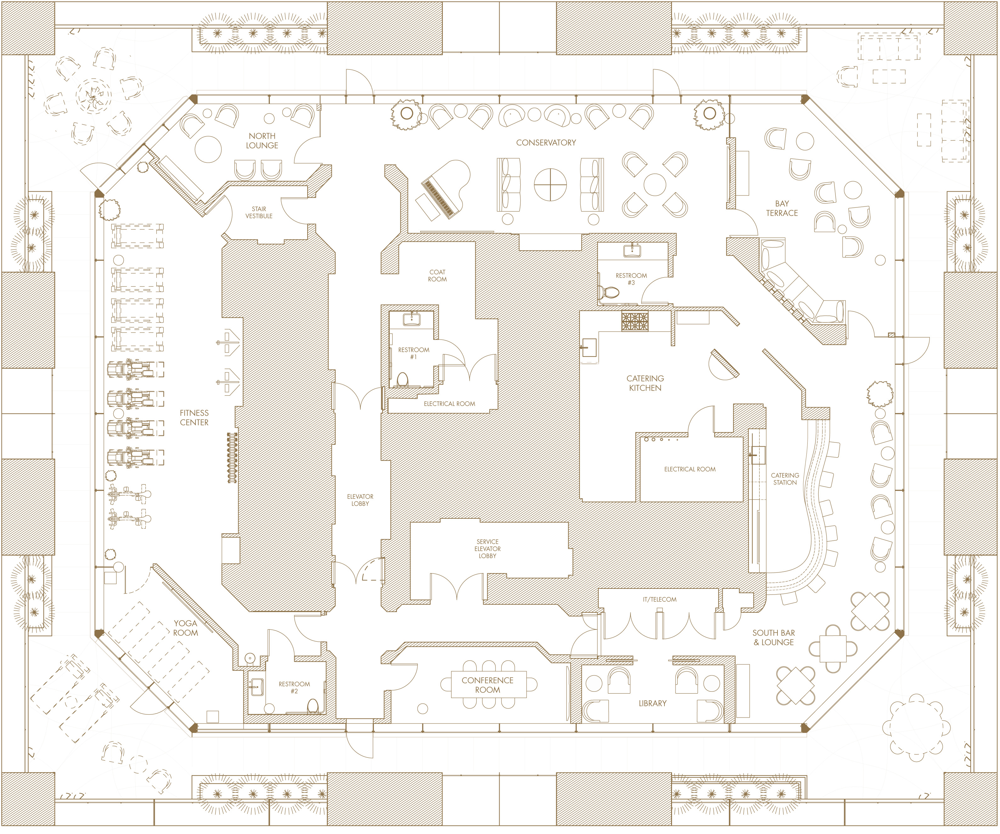
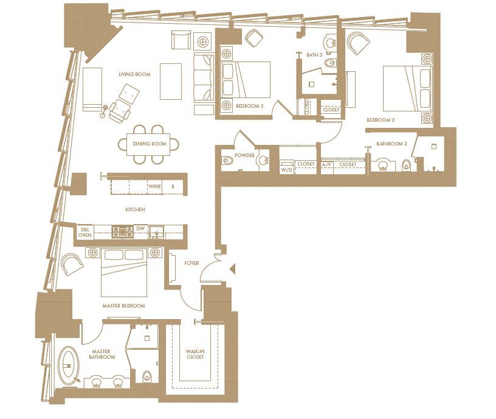
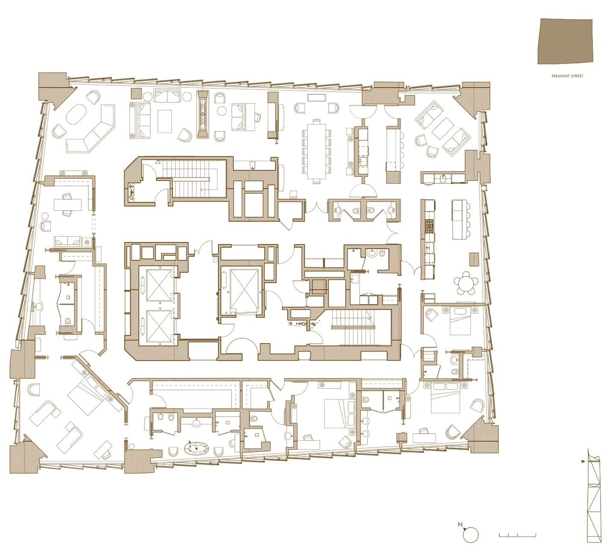

181 Fremont is an 803-foot (244 meters) mixed-use development with 67 condos on the floors 41 to 57, designed by [Heller Manus Architects](https://hellermanus.com/) and located in the South of Market District in San Francisco.

&#8593; plan of the amenities floor     

&#8593; plan of unit 64A: though not as huge as the penthouse, this unit does provide two natural-lit bathroom, particularly a masters with a free-standing tub by the floor-to-ceiling glass curtain   

&#8593; plan of the Grand Penthouse. This penthouse boasts 3 bedrooms each with their own baths in addition to the masters with his-and-hers sides of bathroom and closet with the his-side connected to a study, a kitchen with nook area, a separate butlers pantry with bar seating by the family room, a formal dining room connected to the living room and sitting area. One of the bedrooms can be easily converted to a maid's quarters, as it's situated in a self-contained area with the utilities room and access to the kitchen. One thing to note, though, is that the masters might suffer front western exposure, which, coupled with the ample glass exterior, might keep the rooms hot in afternoons.   

Sources: [Business Insider](https://www.businessinsider.com/penthouse-apartment-for-sale-at-facebook-offices-2017-9) [181 Fremont](https://181fremont.com/floor-plans/)
