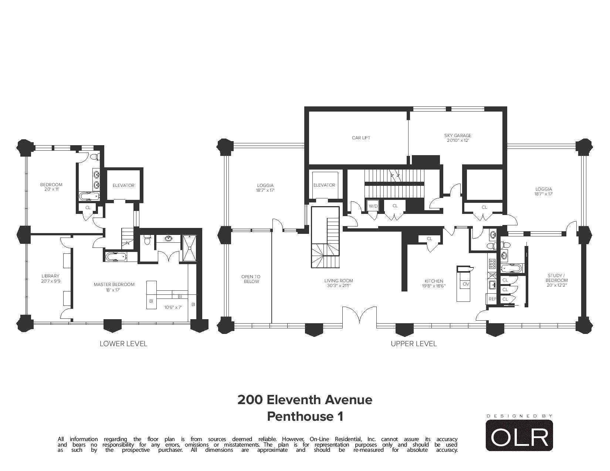
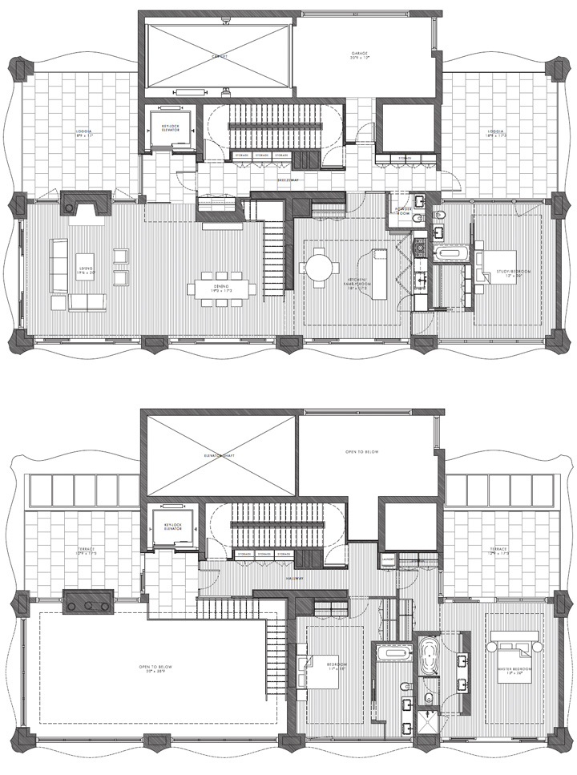
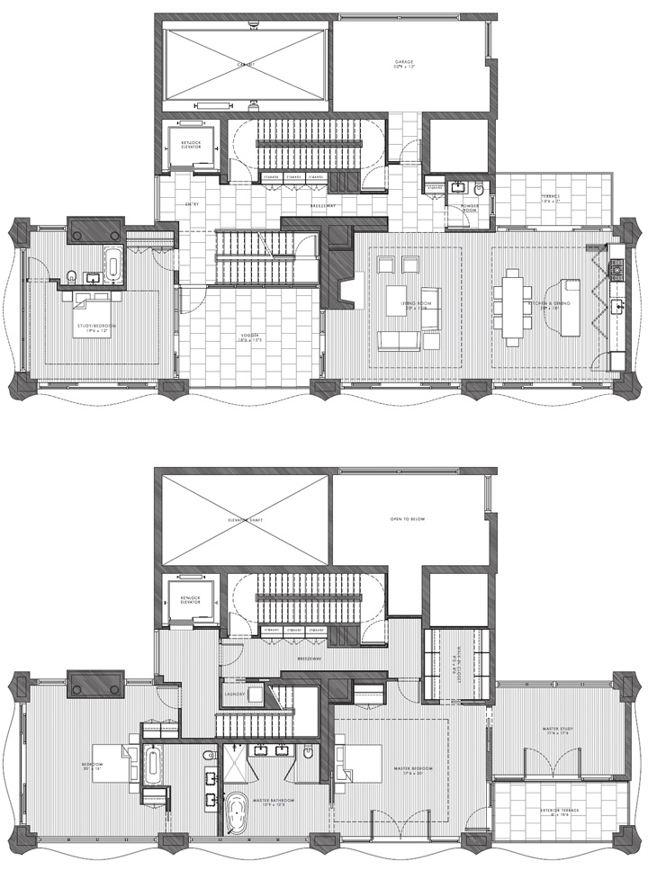
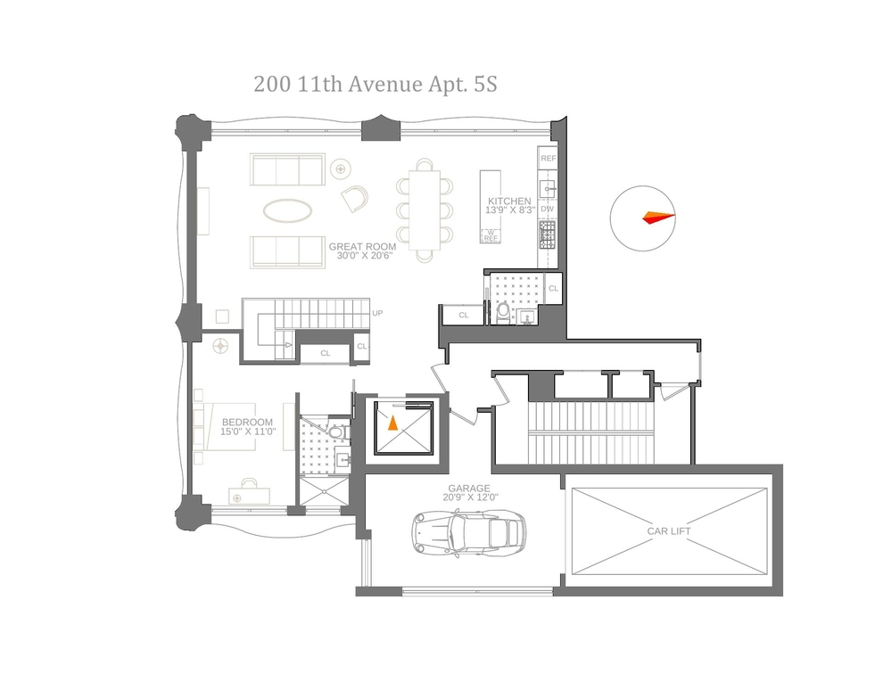

&#8593; plans of penthouse 1. 200 Eleventh Avenue is known for the private garage that every apartment has access to, and the project is also known as Sky Garage for this special reason. All the garages have windows as well, which make for wonderful luxurious naturally-lit spaces with Manhattan views.   

&#8593; plans of two other penthouses, which were rumored to be purchased by one of the founders of Dolce & Gabbana, Domenico Dolce, in 2009.   

&#8593; plan of a more modest floor.

Sources: [Variety](https://variety.com/2009/dirt/real-estalker/a-little-domenico-dolce-floor-plan-porn-1201229711/#article-comments) [ArchDaily](https://www.archdaily.com/176782/200-eleventh-avenue-selldorf-architects)