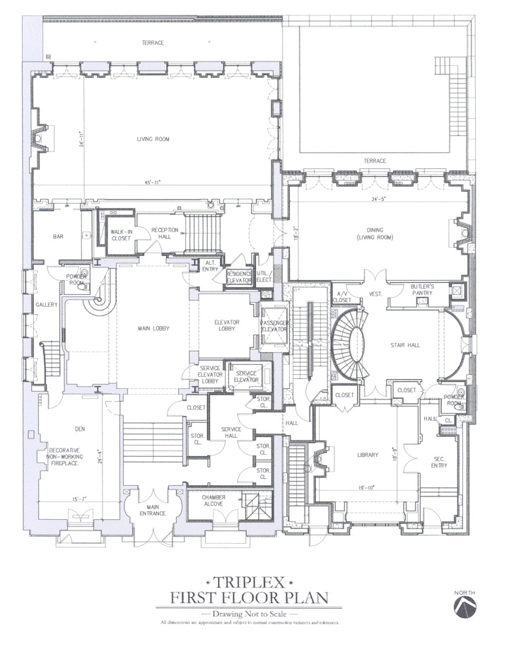
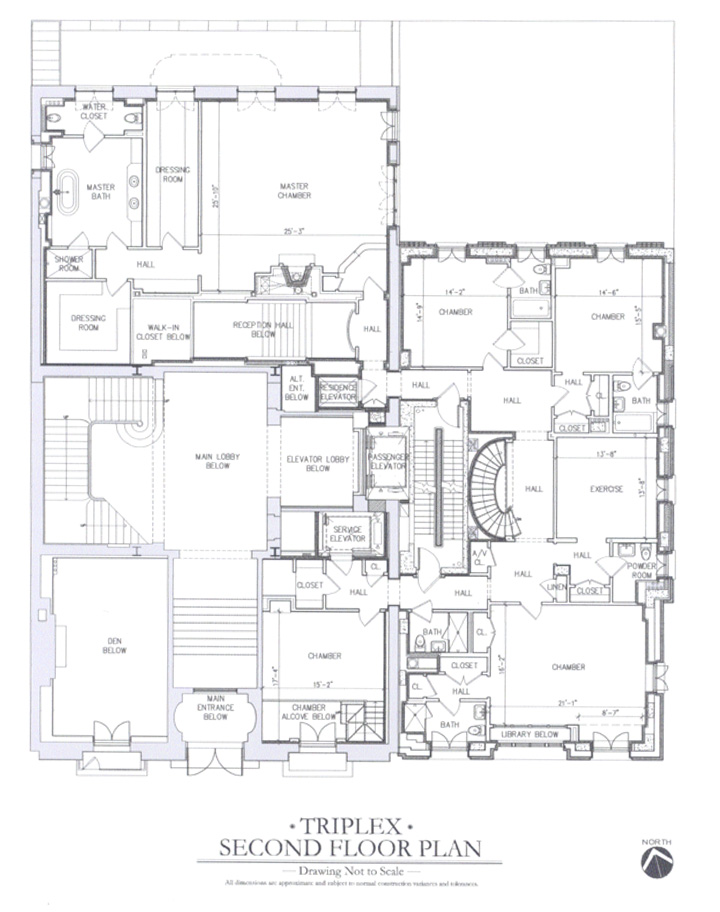
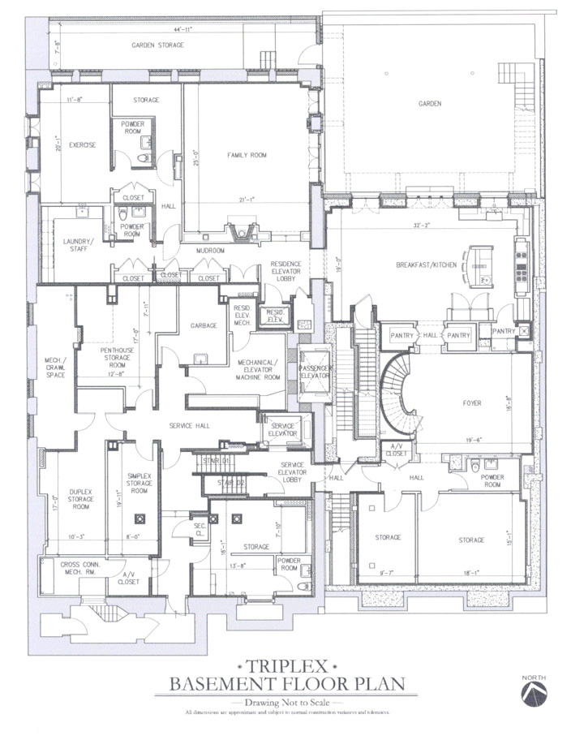
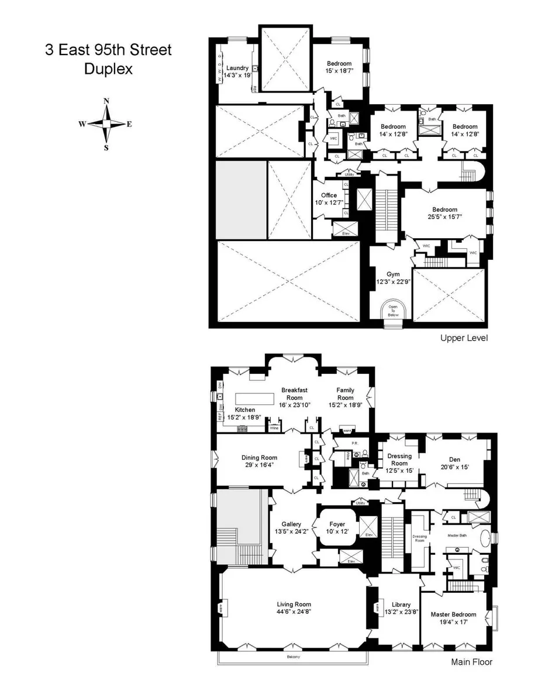
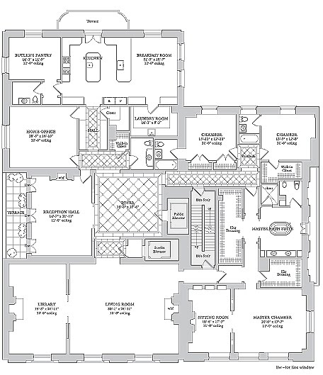
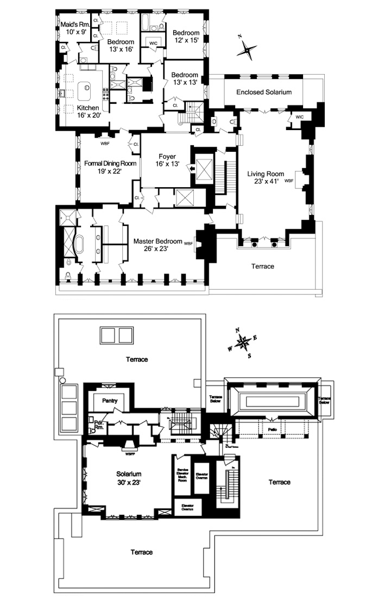
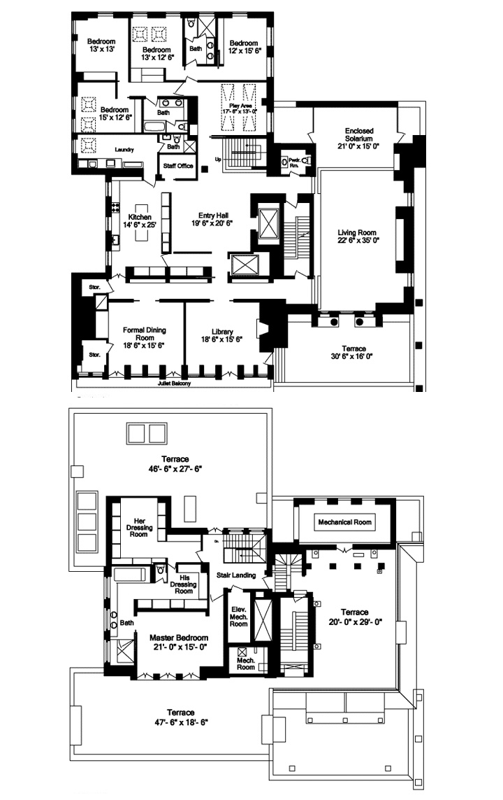

The Carhart Mansion is an Upper East Side development originally designed by architect Horace Trumbauer in 1916, and currently it is subdivided into four separate luxury condoniums, with one triplex, one duplex, one simplex, and one two-story penthouse.

&#8593; plans of the triplex, with two above-ground floors and part of the development's basement. The main entrance on the first floor services the entire building, whereas two additional entries lead into a second floor bedroom and the grand stairhall of the triplex, respectively. The entrance that opens to the main lobby leads into the dining and living room, which is connected to a front-facing den through a gallery tucked behind the bar. The second floor contains 5 bedrooms, including the masters.

&#8593; plans of the duplex occupying the parlor floor of the mansion, which means the living room, gallery, dining room, and breakfast room all have shocking 18-foot ceilings.

&#8593; plans of the simplex occupying the fifth floor of the mansion with a luxurious masters suite and terraces off of the dining room and kitchen.

&#8593; plans of the penthouse, the bottom one being a proposed revised plan with a masters suite occupying the entire top floor.

Sources: [Variety](https://variety.com/2010/dirt/real-estalker/lets-have-a-look-see-at-the-carhart-mansion-1201229947/)
