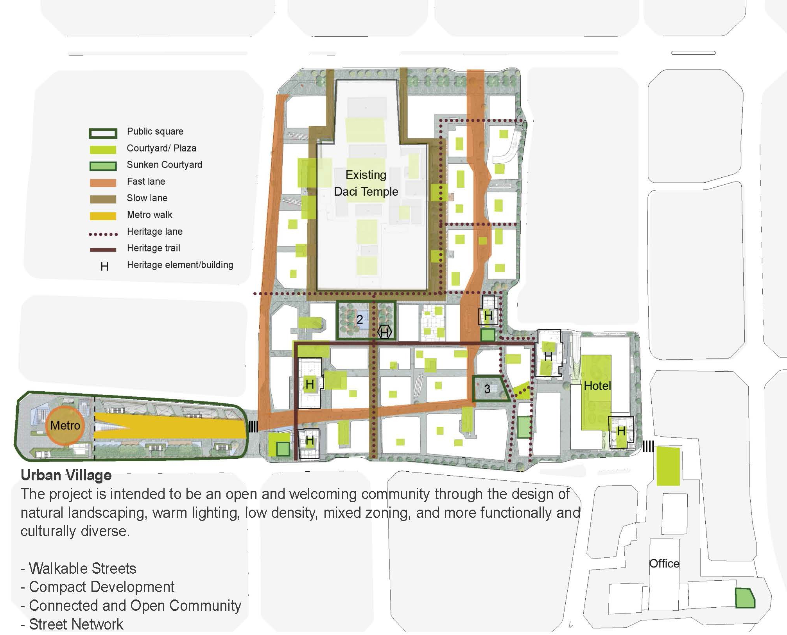

Taikoo Li Chengdu is a commercial development by Sino-Ocean Group and Swire Properties in the heart of Chengdu. The open-streets commercial district surrounds the central inspiration for the project, the Daci Temple. Since it's opening, Taikoo Li has become the premier commercial district in Chengdu, with a myriad of luxury boutiques and cultural destinations, such as the Fang Suo Commune bookstore, as well as top-of-the-line stay options such as The Temple House.

  

&#8593; master plans of Taikoo Li Chengdu.

Sources: [Architizer](https://architizer.com/projects/sino-ocean-taikoo-li-chengdu/)