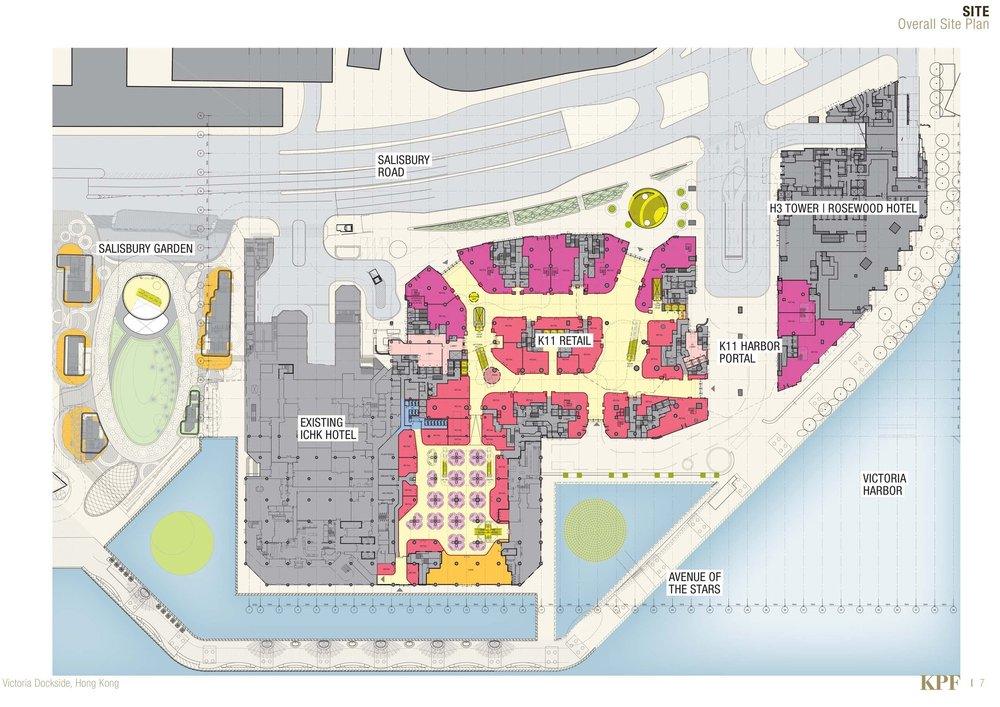
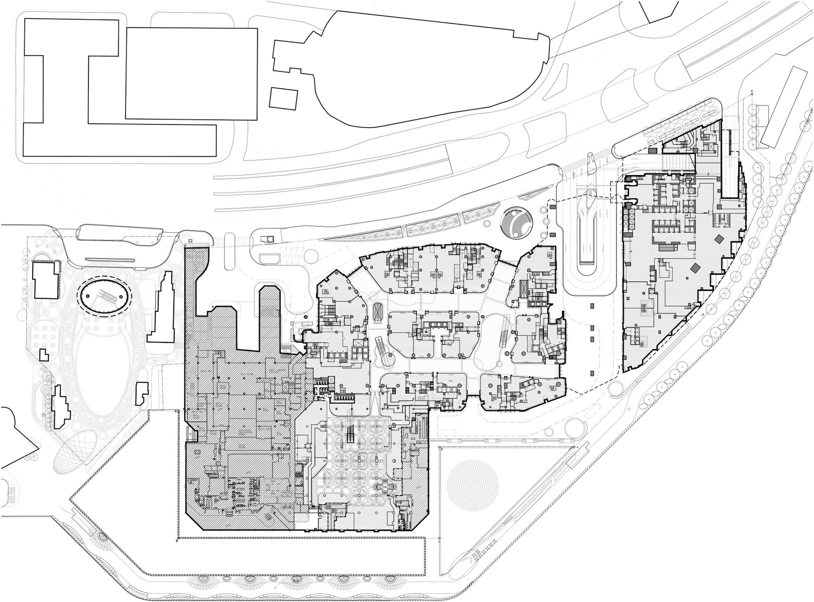
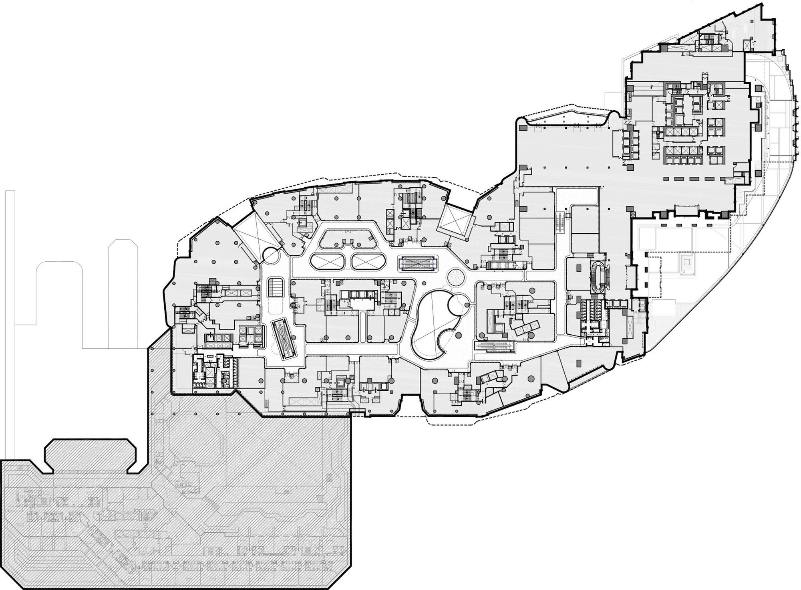

K11 is the premium mall brand by the Hong Kong real estate conglomerate New World Development. Currently, the namesake mall exists in several prominent Chinese cities, including Shanghai, Guangzhou, Shenyang, and Wuhan. Most K11 locations pride themselves over pioneering the "art mall" formula, by combining traditional retail experience with immersive art exhibits, and in doing so attracting more of China's younger shoppers and growing middle class. K11 MUSEA sits at the top of the pyramid of other K11 malls, as it is situated at the heart of art and design district Victoria Dockside in Hong Kong with ambitions to become the world's finest cultural-retail destination.

&#8593; colored ground floor plan. Entrance to the supertall tower and Rosewood Hotel is to the far right of the plan, with the left side being the existing hotel development.

  

&#8593; uncolored ground floor and upper floor plans.

Sources: [ArchDaily](https://www.archdaily.com/927244/k11-musea-hong-kong-kpf-plus-rlp)