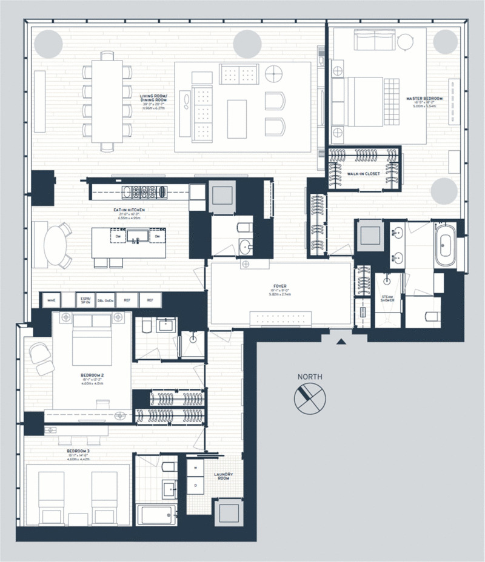
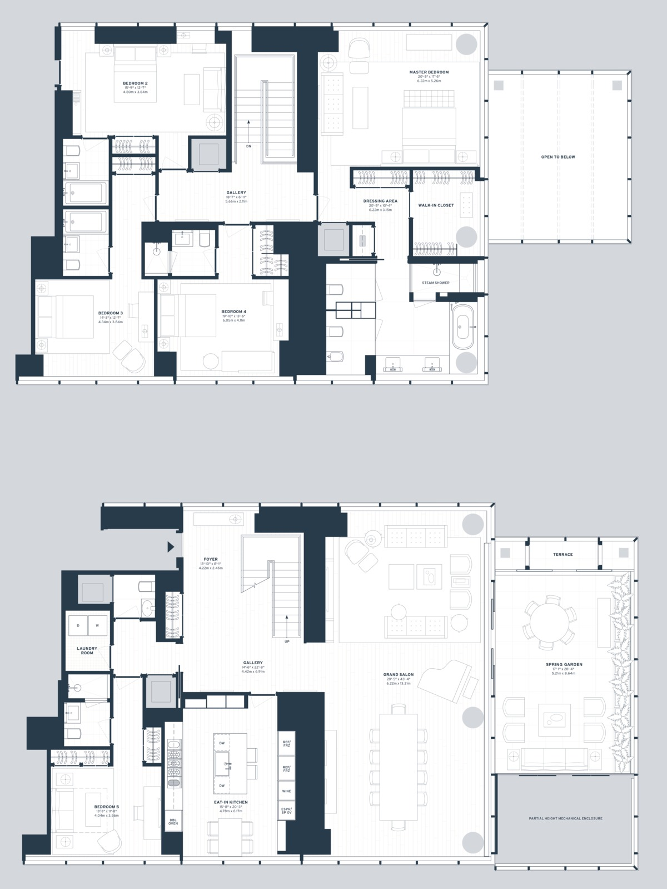
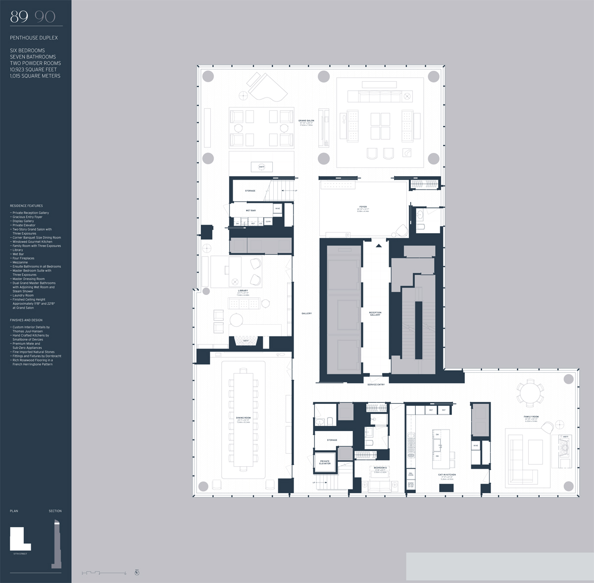
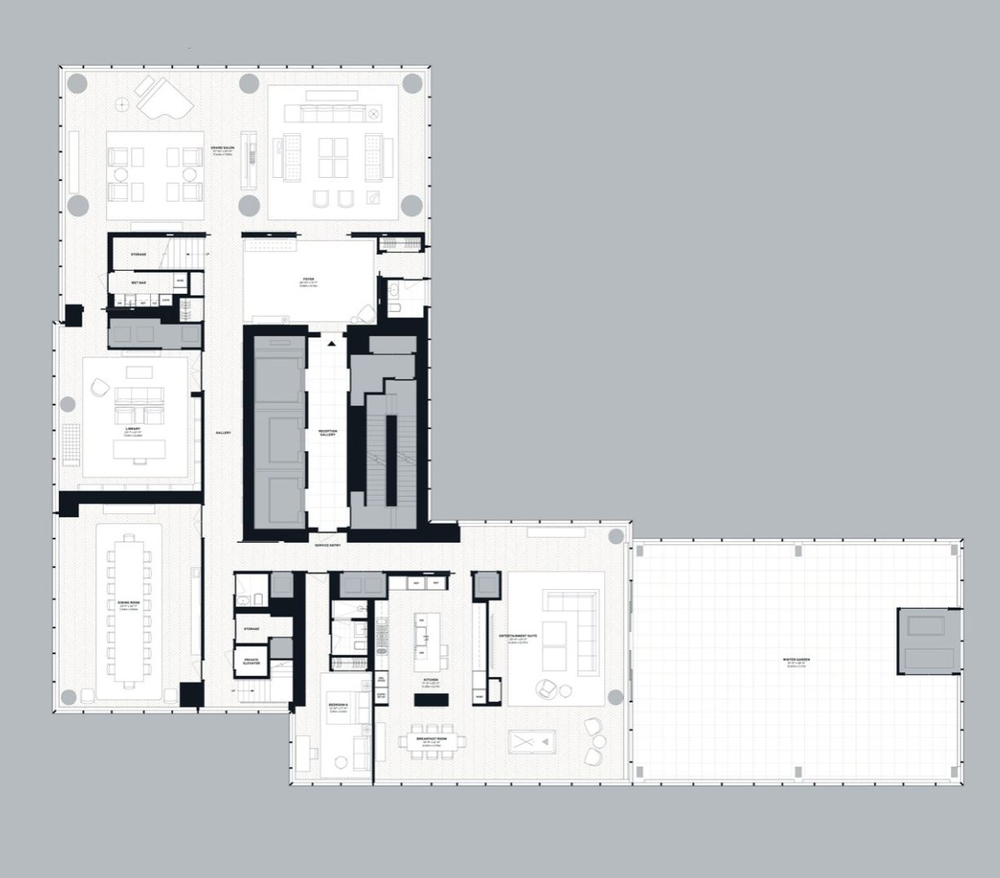
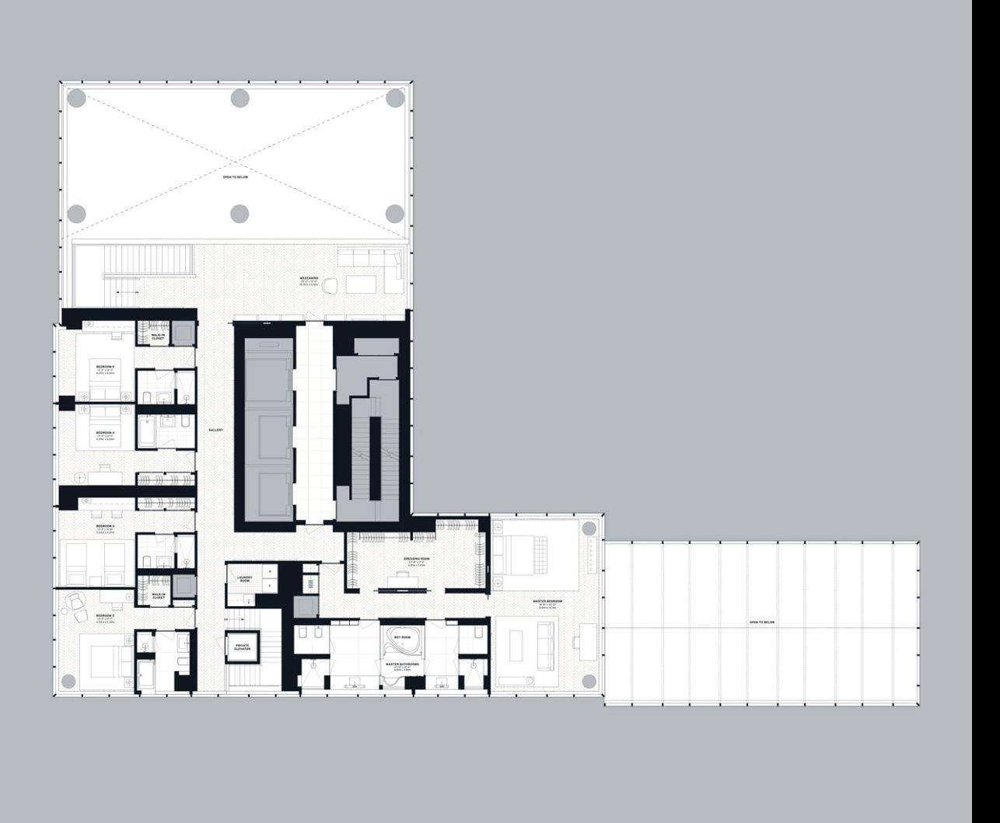

&#8593; on the smaller side of things, this unit is conveniently separated into three sections. The master bathroom's window-front tub and kitchen that can be easily closed off from the rest of the house are pluses.   

&#8593; the duplex unit which features a grand, two story solarium/spring garden, as well as one of the building's few out door terraces.   

&#8593; one of the full-floor flats with the masters situated in the solarium space and lavish his and hers baths.   

&#8593; lower floor of the penthouse, rumored to be purchased by Michael Dell. This floor's layout requires further inspection as there is great disconnect between the living, dining, and family rooms, requiring treks through long, winding corridors. A better alternative layout might have the dining room along with the living room in the grand salon, kitchen in place of the current library, and family room in the current dining room. The current family room might be converted into a guest suite with a nice, large bathroom, or even better, a gym/spa/sauna/theater entertainment wing.    

&#8593; this is the larger version of the rooftop penthouse at a lower floor, with a large terrace/solarium but most of the same issues with the 89-90 penthouse.   

Sources: [CurbedNY](https://ny.curbed.com/2018/2/22/17039904/one57-billionaires-row-most-expensive-penthouse-buyer-revealed)