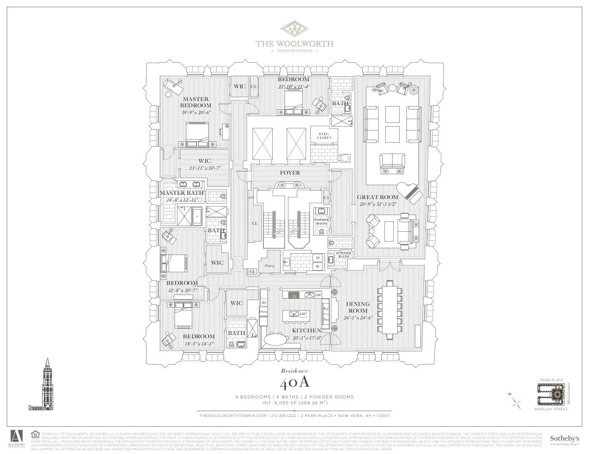
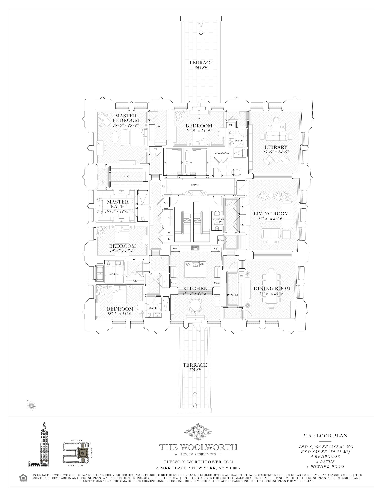
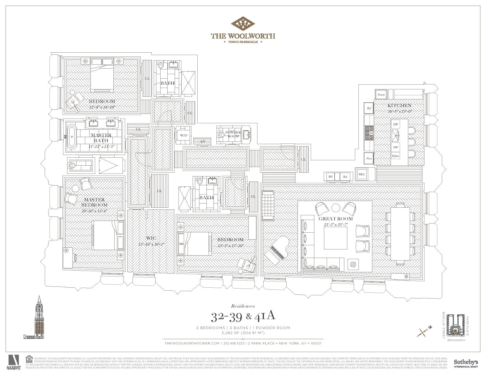
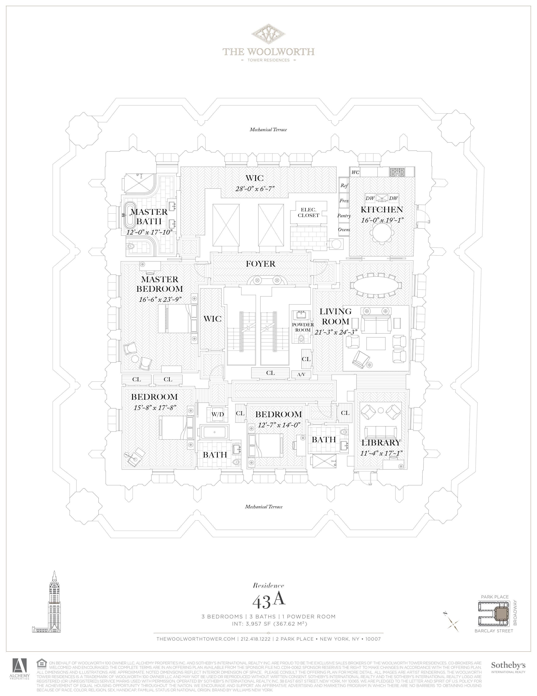
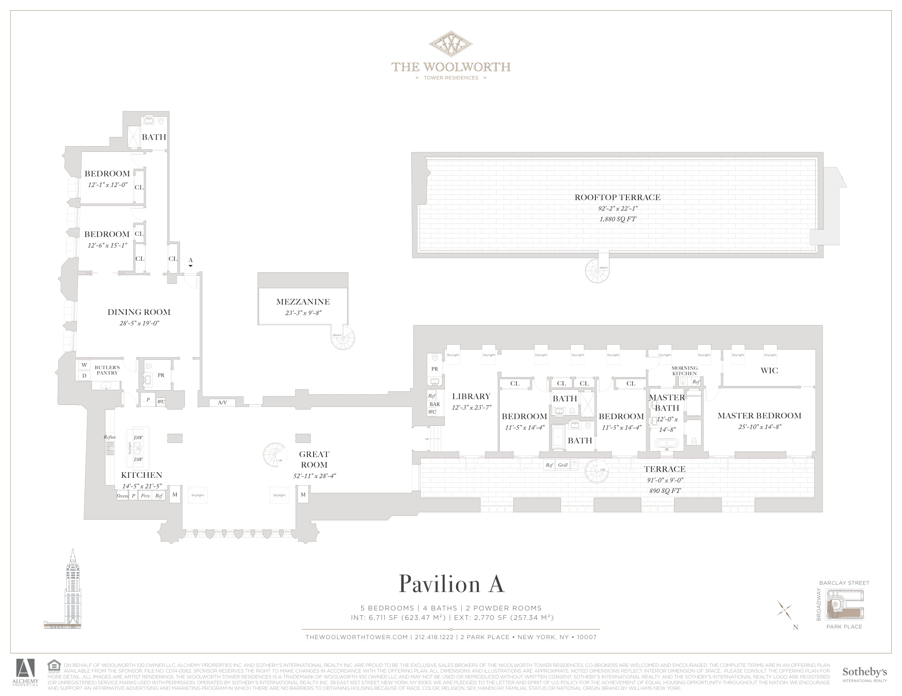

&#8593; long great room, NE side bedroom can also be turned into a library connecting the great room and the masters.   

&#8593; two large terraces on both sides of the unit, with the SW one leading out of the breakfast room. Library, living room, dining room line up for a grand entertainment wing of the house.   

&#8593; a smaller, half-floor unit with just as nice layout.   

&#8593; the building's floors get smaller the higher up you go.   

&#8593; the pavillion floors sit just above street level. The layout is interesting, with two wings of bedrooms, a mezzanine level, and rooftop, although being so close to the streets might mean more noise and less privacy than the higher up floors. Also, the columns and stairs and walls that divide the unit certainly call for creativity in interior and structural design.   

Sources: [The Woolworth Tower](https://thewoolworthtower.com/)